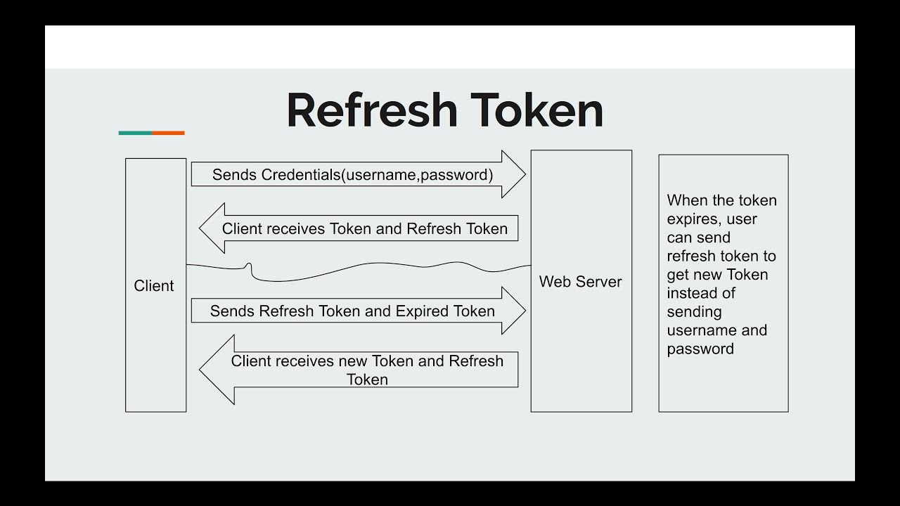

# JWT

**JWT (JSON Web Token)** is used for authentication and authorization purposes in web applications.

When using JWT tokens, it is common to also use refresh tokens to improve the security and user experience of the application.

A refresh token is a separate token that is used to obtain a new access token (JWT) when the current access token expires. The main purposes of using refresh tokens are:

1. **Security**: Access tokens are usually short-lived, which limits the potential damage if they are compromised. When an access token expires, the refresh token can be used to get a new access token without requiring the user to re-authenticate.
2. **User experience**: Since the refresh token can be used to obtain a new access token, users don't need to log in again when their access tokens expire, providing a smoother user experience.

## Where to store both tokens and how to transfer them

### Access token (JWT):
#### Store:
Client side only:
- Memory (variable)
- State manager (Redux)
- LocalStorage (less secure, but provide better user experience)

#### Transfer:
Authorization header

### Refresh token:
#### Store:
Client side:
- HTTP-only cookie

Server side:
- Database

#### Transfer:
Cookie header

## Security

### Note:

The refresh token stored in an HTTP-only cookie does not directly prevent security issues.

If an attacker gets access to the access token (JWT), they can use it to access protected resources until the token expires.

### How can an attacker get the access token (JWT)?
XSS. If you store the token in a place where JS has access to. For example LocalStorage.

### Why is it uncommon to store the access token in the http-only cookie if we need XSS protection?

1. **Complexity of CSRF protection:** While using HTTP-only cookies can help protect against XSS attacks, they introduce the risk of CSRF attacks. To mitigate this risk, you need to implement additional CSRF protection.
2. **Cross-origin requests:** SPAs often make API calls to different domains or subdomains. Browsers may not automatically send cookies with cross-origin requests.
3. **Token handling:** SPAs lose the ability to read or manipulate the access token in JavaScript. This means that they cannot access token metadata (e.g., expiration time, user information) or manage token refreshes programmatically.

### What is the most common setup and flow?

#### Storing:
1. User logs in.
2. Server returns a response with the access token and sets the refresh token in the client's http-only cookie.
3. Client stores the access token into LocalStorage or other persistent storage.
4. Client stores the refresh token into the HTTP-only cookie.

#### Request a protected resource with valid access and refresh tokens:
1. Client gets a response.

#### Request a protected resource with invalid access token and valid refresh token:
1. Client gets an error.
2. Client makes a request to the refresh token endpoint (/refresh-token).
3. Client gets a response with a new access token (the refresh token remains the same). Client is not required to re-authenticate.
