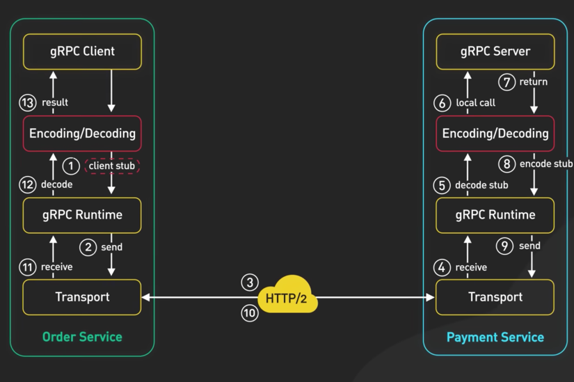
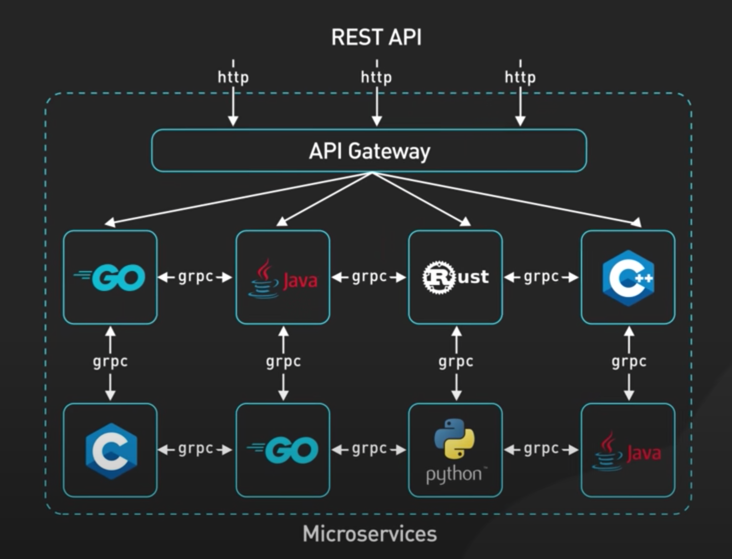

# gRPC

## What is RPC?
It is a communication protocol that allows one program to request a service or execute a procedure on another computer or server over a network.

RPC abstracts the complexity of remote calls, allowing developers to invoke remote procedures as if they were local functions. 

## gRPC
Provides an additional level of abstraction over the standard HTTP tools.

### Some reasons why gRPC can be considered better than REST in certain scenarios:

1. **Performance:** gRPC uses Protocol Buffers, which are more efficient in terms of serialization and deserialization compared to JSON, the format commonly used in RESTful services. This can lead to faster data transfer and reduced network latency.

2. **Contract-first approach:** With gRPC, service contracts are defined using .proto files, which are used to generate client and server stubs in various programming languages. This ensures strong consistency and clear communication of the service interface.

3. **Bi-directional streaming:** gRPC supports bi-directional streaming, which enables continuous data exchange between client and server. REST, in comparison, is limited to request-response communication.

4. **Language-agnostic:** gRPC's use of Protocol Buffers makes it easy to support multiple programming languages, with language-specific libraries available for developers. This is especially helpful for large organizations with polyglot environments.

5. **Tighter communication:** gRPC uses HTTP/2 as its transport protocol, which offers benefits like multiplexing, header compression, and flow control. These features enable more efficient communication between client and server compared to HTTP/1.1, which is commonly used in RESTful services.

### Why isn't gRPC widespread between browsers and web servers?

gRPC is not as widespread between browsers and web servers for several reasons:

1. **Limited browser support:** gRPC relies on HTTP/2 as the transport protocol, and while most modern browsers support HTTP/2, gRPC requires specific features like HTTP/2 trailers, which are not universally supported. Browser APIs, such as XMLHttpRequest and Fetch, do not expose the necessary low-level features needed for gRPC communication.

2. **Lack of native browser support:** Native browser APIs do not support gRPC directly, which means developers need to use third-party libraries or workarounds, such as gRPC-Web, to use gRPC in a browser environment. This adds complexity and may introduce additional overhead compared to using REST, which is natively supported by browsers.

3. **Human-readable formats:** One of the key benefits of REST is its use of JSON, which is a human-readable and widely supported data format. gRPC, on the other hand, uses Protocol Buffers, a binary format that is not as human-friendly. While Protocol Buffers have performance advantages, they may not be as suitable for scenarios where human readability and accessibility are important, such as debugging or manually testing APIs through a browser.

4. **Compatibility with existing web infrastructure:** REST is built on top of the familiar HTTP protocol, making it easy to integrate with existing web infrastructure like caching, proxies, and content delivery networks (CDNs). gRPC, while using HTTP/2, requires specific support and configuration to work seamlessly with these tools, which might not be readily available.

5. **Learning curve and adoption:** REST has been around for a longer time and is a widely adopted architectural style for web services. Many developers are already familiar with REST principles and JSON data format. In contrast, gRPC introduces new concepts like Protocol Buffers, .proto files, and code generation, which require additional learning and tooling.

It's more popular to be as a communication mechanism between microservices:

