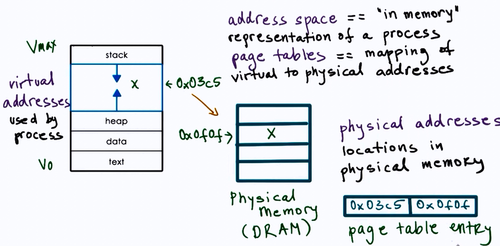
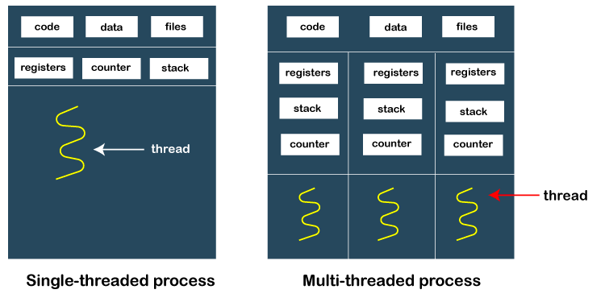

# Process & Thread

## What is Process?
**A process is an instance of a program that is being executed**. When we run a program, it does not execute directly. It takes some time to follow all the steps required to execute the program, and following these execution steps is known as a process.

A process can create other processes to perform multiple tasks at a time; the created processes are known as clone or child process, and the main process is known as the parent process. Each process contains its own memory space and does not share it with the other processes. It is known as the active entity. A typical process remains in the below form in memory.

### How do Processes work?
When we start executing the program, the processor begins to process it. It takes the following steps:

1. Firstly, the program is loaded into the computer's memory in binary code after translation.
2. A program requires memory and other OS resources to run it. The resources such that registers, program counter, and a stack, and these resources are provided by the OS.
3. A register can have an instruction, a storage address, or other data that is required by the process.
4. The program counter maintains the track of the program sequence.
5. The stack has information on the active subroutines of a computer program.
6. A program may have different instances of it, and each instance of the running program is knowns as the individual process.

### Features of Process
1. Each time we create a process, we need to make a separate system call for each process to the OS. The fork() function creates the process.
2. Each process exists within its own address or memory space.
3. Each process is independent and treated as an isolated process by the OS.
4. Processes need IPC (Inter-process Communication) in order to communicate with each other.
5. A proper synchronization between processes is not required.

## What is Thread?
A thread is the subset of a process and is also known as the lightweight process. A process can have more than one thread, and these threads are managed independently by the scheduler. All the threads within one process are interrelated to each other. Threads have some common information, such as data segment, code segment, files, etc., that is shared to their peer threads. But contains its own registers, stack, and counter.

### How does thread work?
As we have discussed that a thread is a subprocess or an execution unit within a process. A process can contain a single thread to multiple threads. A thread works as follows:

1. When a process starts, OS assigns the memory and resources to it. Each thread within a process shares the memory and resources of that process only.
2. Threads are mainly used to improve the processing of an application. **In reality, only a single thread is executed at a time, but due to fast context switching between threads gives an illusion that threads are running parallelly.**
3. If a single thread executes in a process, it is known as a single-threaded And if multiple threads execute simultaneously, then it is known as multithreading.

Read more: https://www.javatpoint.com/process-vs-thread
